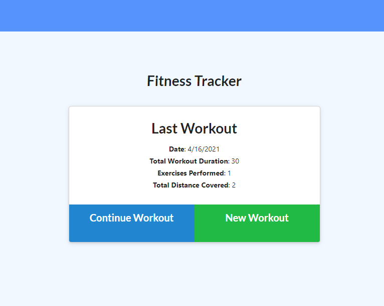
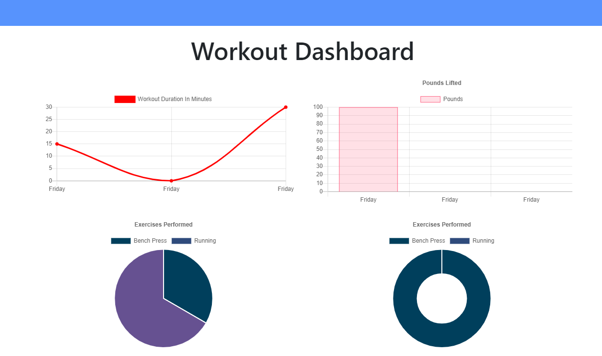

# My Fitness Tracker

## Deployed Link: https://myfitnesstracker-mf.herokuapp.com/
## Github Repo Link: https://github.com/myrlaf25/myFitnessTracker

</img>

## Table of Contents

-[Description](#description)
-[Installation](#installation)
-[Usage](#usage)
-[Credits](#credits)
-[License](#license)
-[Tests](#tests)

# Description

This is a fitness tracker application. The front end code was provided by Trilogy/UofA. This app is will assist the user in keeping track of their workout routines, either a resistance workout or cardio workout. I created a Mongo database with a Mongoose schema and handled the routes with Express.js.  

# User Story

* As a user, I want to be able to view create and track daily workouts. I want to be able to log multiple exercises in a workout on a given day. I should also be able to track the name, type, weight, sets, reps, and duration of exercise. If the exercise is a cardio exercise, I should be able to track my distance traveled.

        # Fitness Tracker Image
</img>

## Business Context

The consumer will reach their fitness goals more quickly, when they track their workout progress.

## Installation

The user will have to install Express.js, Mongoose, and MongoDB. The user may also install Morgan, it will show the user the log of all the commands in the terminal as to GET, POST, PUT. The app was deployed using MondoDB Atlas and Heroku.   

## Usage

When the user loads the page, they should be given the option to create a new workout or continue with their last workout.

The user should be able to:

  * Add exercises to the most recent workout plan.

  * Add new exercises to a new workout plan.

  * View the combined weight of multiple exercises from the past seven workouts on the `stats` page.

  * View the total duration of each workout from the past seven workouts on the `stats` page.

## Credits

Trilogy provided starter code mainly for front-end and I worked on the models and api routes. I also downloaded all the neccessary packages and created the database in MongoDB using Compass. 

## License

For more information on the License, please click on the link: 
-[License] https://opensource.org/licenses/ISC

## Tests
Once the user enters the command, nodemon server.js in the terminal, the user may utilize Insomnia Core to check the functionality. The API routes: GET will display all information that the user input into the app. The data will be displayed in a formatted JSON. The user may also test API for POST, and PUT routes. This shows the user the app is able to successfully CREATE, UPDATE, and will also show the user graphs data in the dashboard for the last 7 workouts. 

    # Fitness Tracker Dashboard Image
</img>

-[GitHub] {https://github.com/myrlaf25}

##Questions
To contact me directly, please email me at: myrlaf25@gmail.com.